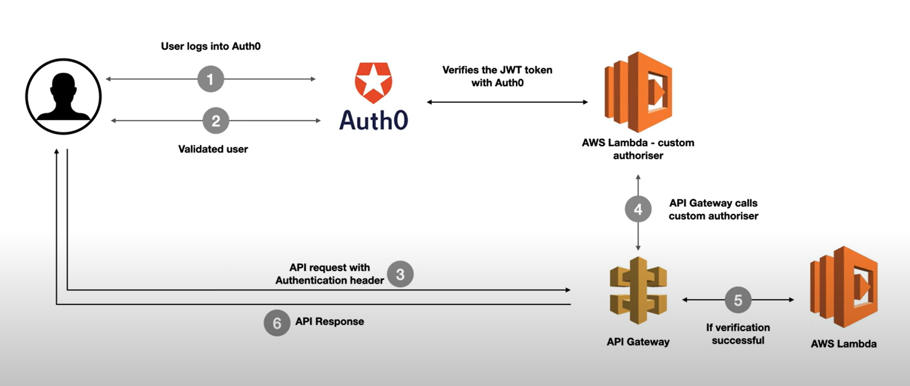
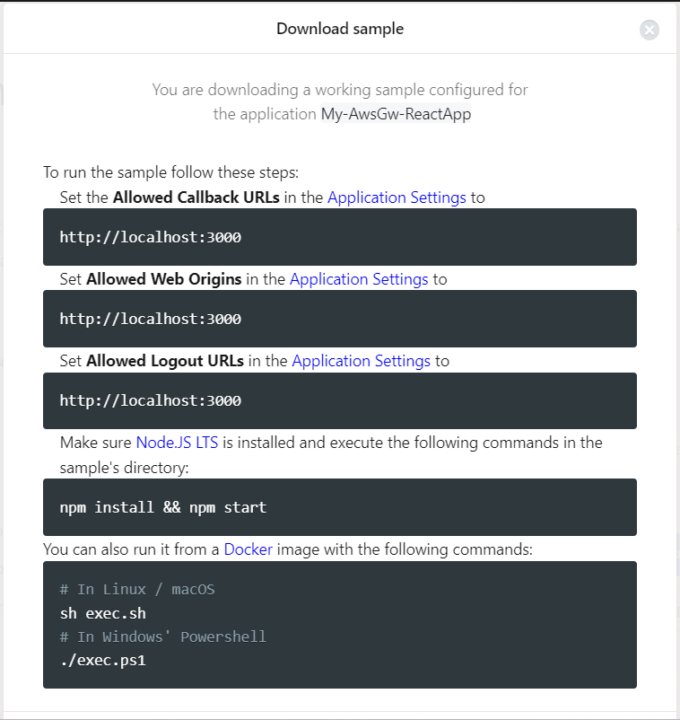

# API Gateway Auth0 custom Authoriser + REACT APP | Serverless Security
* https://youtu.be/pF5oS3mI6IU?si=lAfzjli59QxGknbc
* https://auth0.com/docs/customize/integrations/aws/aws-api-gateway-custom-authorizers

# Auth0 Flow



# Install Node and Yarn

Ensure to use Node LTS
```
$ nvm list
$ nvm use 20.14.0
$ nvm alias default 20.14.0
$ node -v
```

Then install Yarn as global npm package
```
$ sudo apt update
$ sudo apt install nodejs npm
$ npm install --global yarn
$ yarn --version
```


# Create Auth0 Application

Login to Auth0 -> Applications -> Create Application -> Name "My-AwsGw-ReactApp" -> Application Type = Single Page Apps -> React

Following the Quick Start you can have the Frontend (Client) code.

You can download Sample:




Or you can View it on Github: https://github.com/auth0-samples/auth0-react-samples/tree/master/Sample-01

Or you can follow this tutorial to create React App: https://react.dev/learn/start-a-new-react-project

Or you can clone it from the template: https://github.com/facebook/create-react-app


To run the sample, it recommends to use YARN tool:
* https://linuxhint.com/install_yarn_ubuntu/


## Configure Callback URLs
A callback URL is a URL in your application where Auth0 redirects the user after they have authenticated. The callback URL for your app must be added to the `Allowed Callback URLs` field in your Application Settings. If this field is not set, users will be unable to log in to the application and will get an error.

If you are following along with the sample project you downloaded from the top of this page, you should set the Allowed Callback URL to `http://localhost:3000`.

## Configure Logout URLs
A logout URL is a URL in your application that Auth0 can return to after the user has been logged out of the authorization server. This is specified in the returnTo query parameter. The logout URL for your app must be added to the `Allowed Logout URLs` field in your Application Settings. If this field is not set, users will be unable to log out from the application and will get an error.

If you are following along with the sample project you downloaded from the top of this page, the logout URL you need to add to the Allowed Logout URLs field is `http://localhost:3000`.


## Configure Allowed Web Origins
You need to add the URL for your app to the `Allowed Web Origins` field in your Application Settings. If you don't register your application URL here, the application will be unable to silently refresh the authentication tokens and your users will be logged out the next time they visit the application, or refresh the page.

If you are following along with the sample project you downloaded from the top of this page, you should set the Allowed Web Origins to `http://localhost:3000`.

# API Gateway using Custom Authorizers
* https://auth0.com/docs/customize/integrations/aws/aws-api-gateway-custom-authorizers

