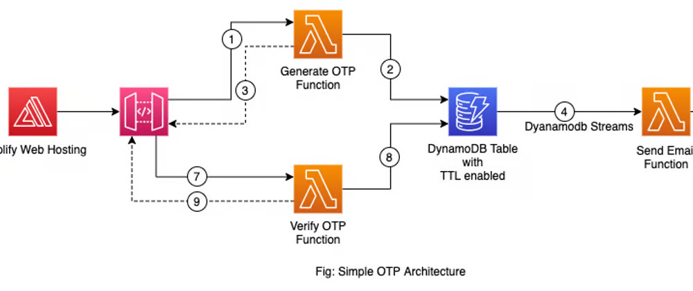

# Simple OTP service

This repository contains a simple OTP service build with AWS Serverless services.

### Architecture:



More information in this **[Blog Post](https://tuts.heomi.net/create-a-simple-otp-system-with-aws-serverless/)**


# Backend

Swith to NodeJS20 LTS
```
$ nvm ls
$ nvm use v20.14.0
$ nvm alias default v20.14.0
$ node --version
```

Using SAM to build and deploy
```
$ sam build
$ sam deploy --guided --profile tvt_admin
```

You can delete stack after deployment
```
$ sam delete --stack-name "simple-otp" --profile tvt_admin
```

Deployed information
```bash
CloudFormation outputs from deployed stack
-------------------------------------------------------------------------------------------------
Outputs

-------------------------------------------------------------------------------------------------
Key                 ApiBaseUrl

Description         Base Url

Value               https://dqj7v8wfea.execute-api.us-east-1.amazonaws.com/dev/

-------------------------------------------------------------------------------------------------


Successfully created/updated stack - simple-otp in us-east-1
```
# Frontend

Run in local
```
$ npm install --global yarn
$ yarn install
$ yarn serve
$ npm run serve
```

If some failed, then can downgrade NodeJS
```
$ nvm ls
$ nvm use v14.21.2
$ nvm alias default v14.21.2
$ node --version
```

After running `yarn serve` command
```
  App running at:
  - Local:   http://localhost:8080/
  - Network: http://172.29.248.234:8080/

  Note that the development build is not optimized.
  To create a production build, run yarn build.
```

# Fix CORS
* (How to enable CORS with AWS SAM)[https://stackoverflow.com/questions/67065130/how-to-enable-cors-with-aws-sam]

What solved it for me was adding the following to my template.yaml:
```yaml
Globals:
    Api:
        Cors:
            AllowMethods: "'GET,POST,OPTIONS'"
            AllowHeaders: "'content-type'"
            AllowOrigin: "'*'"
            # AllowCredentials: true  Uncomment only if you choose a specific origin instead of the * wildcard.
```

You also need to return these headers with the response in each endpoint:
```js
return {
    statusCode: 200,
    headers: {
        "Access-Control-Allow-Headers" : "Content-Type",
        "Access-Control-Allow-Origin": "*", // Allow from anywhere 
        "Access-Control-Allow-Methods": "GET" // Allow only GET request 
    },
    body: JSON.stringify(response)
}
```